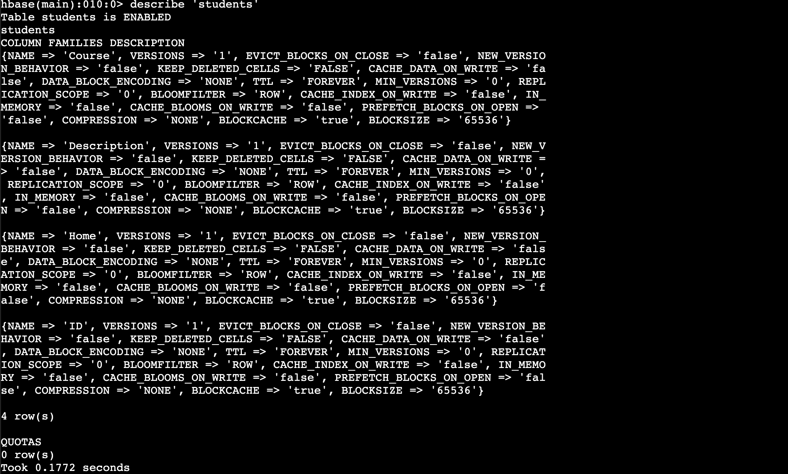

# HBase Demo

- 执行start-hbase.sh，并输入yes，启动Hbase


- 输入hbase shell 命令进入Hbase命令行界面


- 输入如下命令创建表

    ```mysql
    create 'students','ID','Description','Course','Home'
    ```


- 输入如下命令插入数据

    ```mysql
    put 'students','001','Description:Name','Li Lei'
    put 'students','001','Description:Height','176'
    put 'students','001','Course:Chinese','80'
    ```


- 输入如下命令查看描述表信息

    ```mysql
    describe 'students'
    ```


- 执行stop-hbase.sh，退出Hbase

