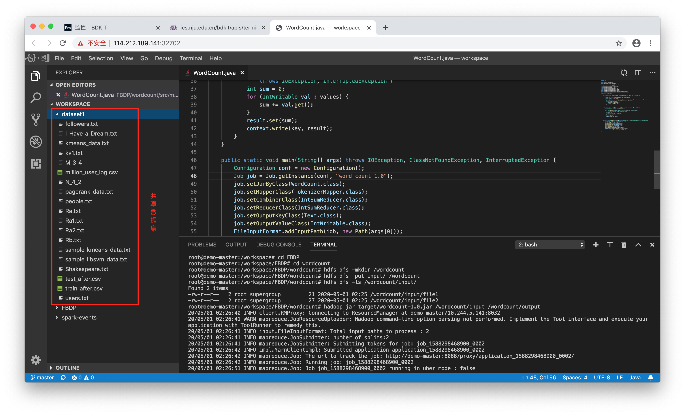
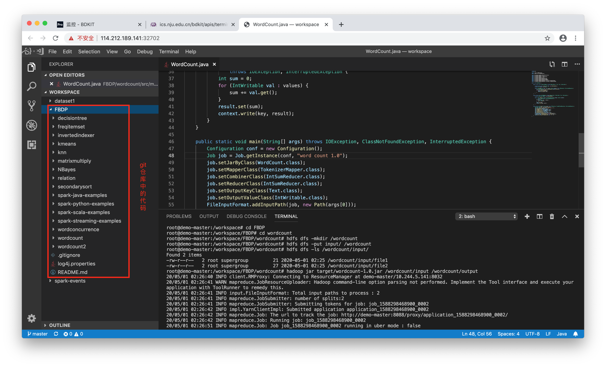
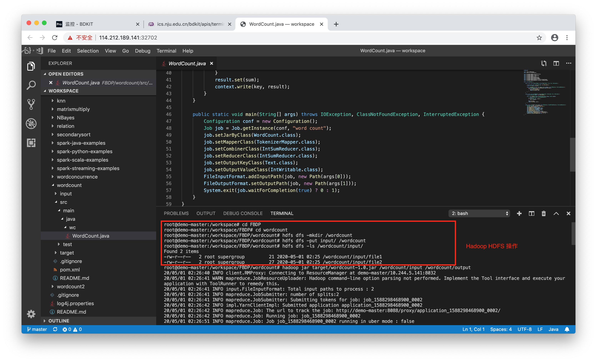
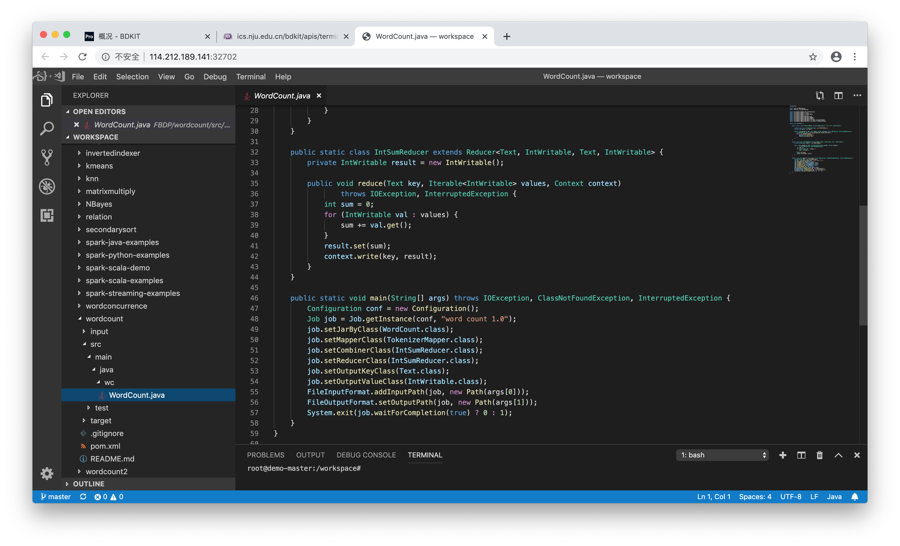
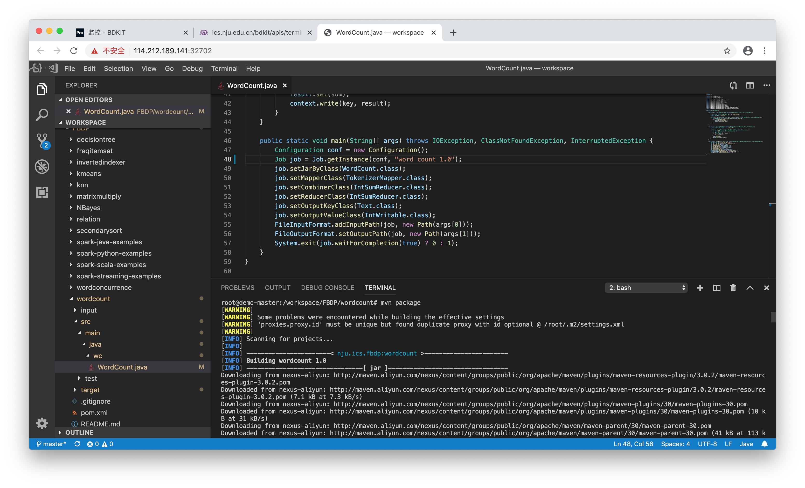
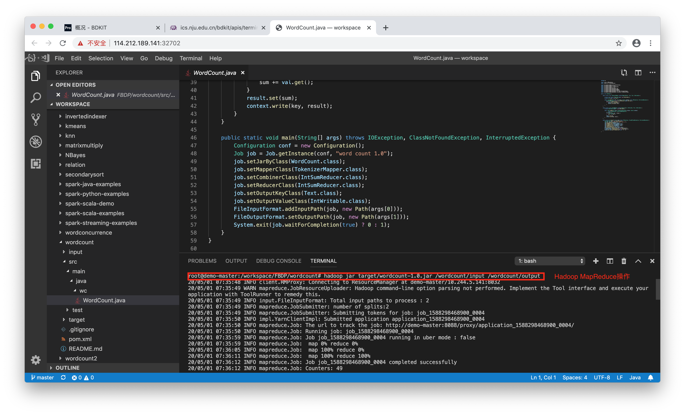
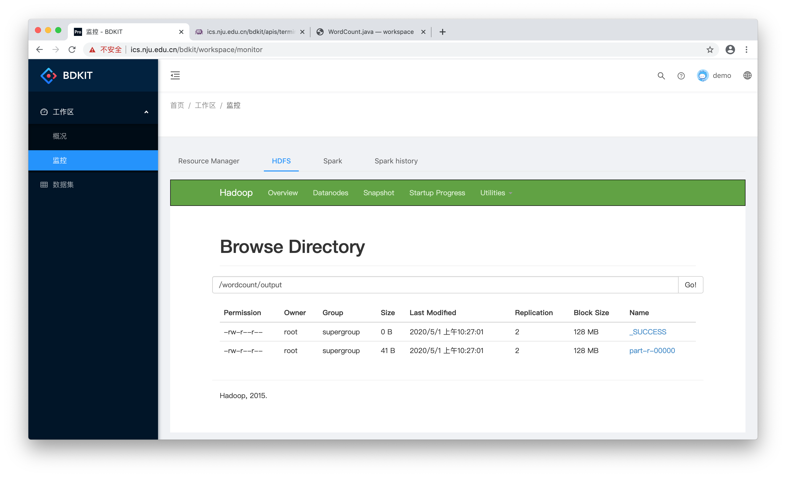
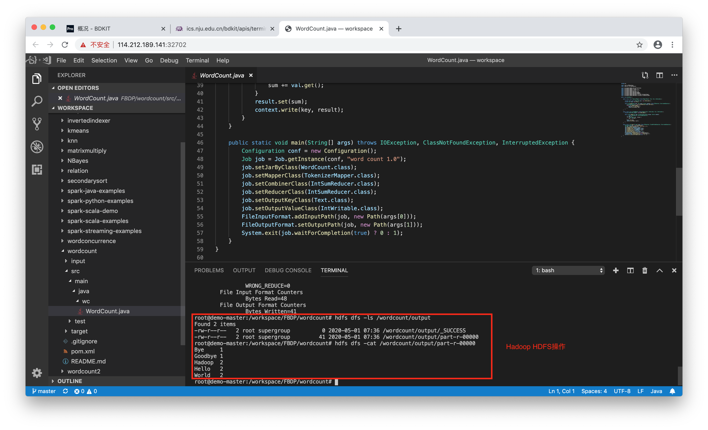
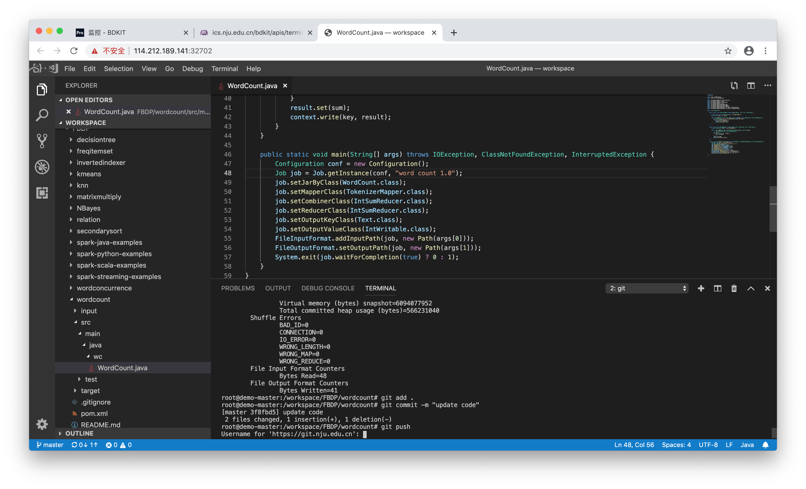

# Programming

#### 编写和运行MapReduce/Spark程序

### 在Vscode中编写和运行程序

1. 点击图标访问Master节点的Vscode容器

2. 在workspace中可以看到共享区中的数据集和从Git仓库中clone的代码

3. 在Vscode Terminal中将数据集上传至HDFS

4. 编写MapReduce Java程序

5. 使用Maven编译和打包MapReduce Java程序

6. 执行MapReduce Java程序

7. 程序执行时在“工作区—监控”页面可以监控集群状态，查看日志和HDFS文件等

8. 程序执行成功后查看HDFS上的输出

9. 同步代码至Git仓库，需要输入用户名和密码

### 在终端编写和运行程序

1. 点击图标访问集群Master节点的终端。

2. 用vi编写程序

3. 运行程序

4. 查看结果

### 在Jupyter Notebook中编写和运行程序

1. 访问Jupyter Notebook的端口，默认密码123456

2. 编写程序

3. 新建Terminal

4. 执行Spark程序

5. 程序执行时在“工作区—监控”页面可以查看任务日志等

5. 查看程序执行结果

6. 关闭Terminal

