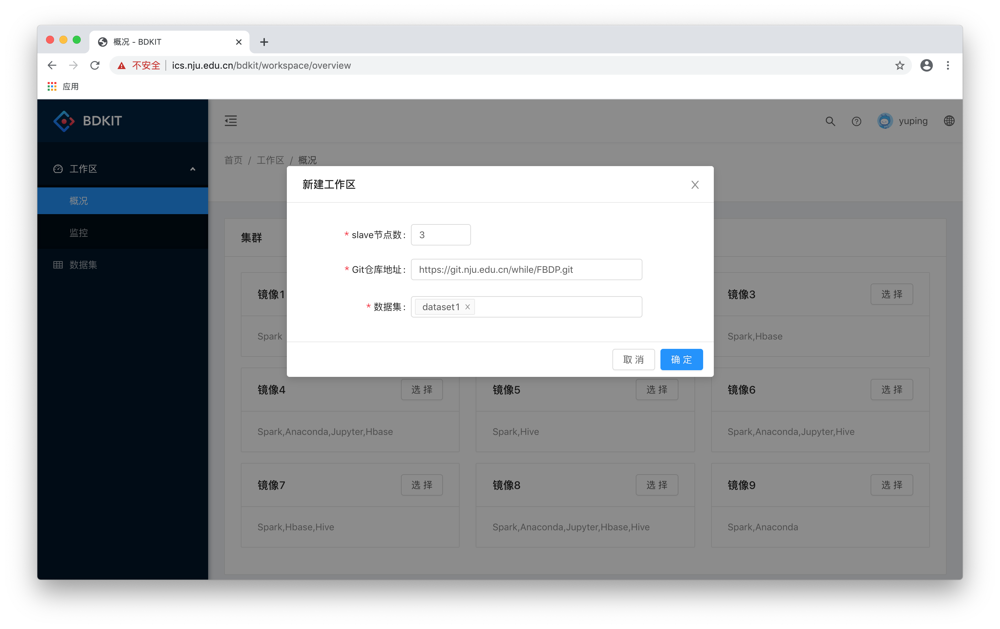

# Workspace

### 工作区约定
- 每个用户只能创建一个以用户名为前缀的集群。当用户名下无集群时，可在“工作区—概况”页面创建集群。当用户已有集群时，在“工作区—概况”页面显示集群基本信息。

### 新建集群

1. 系统提供了多个不同配置的镜像供用户选择。

2. 用户选择其中一个镜像。

3. 在对话框中对集群进行配置。slave节点数、Git仓库地址、数据集均为必填项。Git仓库属性默认为Public，若仓库访问权限是Private则需要进一步输入用户名和密码。数据集可从共享区的数据集中选择，点击输入框后出现下拉框，目前可以选择供实验用的dataset1。（注意：截图中的Git仓库地址仅为展示，实际不可用，请输入自己的Github和其它公网的Git仓库地址）

4. 创建后页面显示集群基本情况。集群Status为“等待中”表示正在创建，创建成功后Status为“就绪”（注意：需要点击圆形的“刷新”按钮主动刷新）。

### 集群概况

1. 集群创建成功后，概况页面由两个卡片组成。上面为集群的基本信息和对集群的基本操作。卡片下部的图标代表的三个操作分别为：访问Vscode、访问SSH终端、删除集群。

2. 下面的卡片显示集群的端口映射信息，点击“访问”可以在新的窗口中访问各个端口对应的Web UI，包括Hadoop/Spark Web UI、Vscode、Jupyter Notebook等。

### 集群操作

1. 打开Vscode

2. 打开SSH终端

3. 删除集群

4. 删除成功后回到主界面，可以再次选择镜像，新建集群

